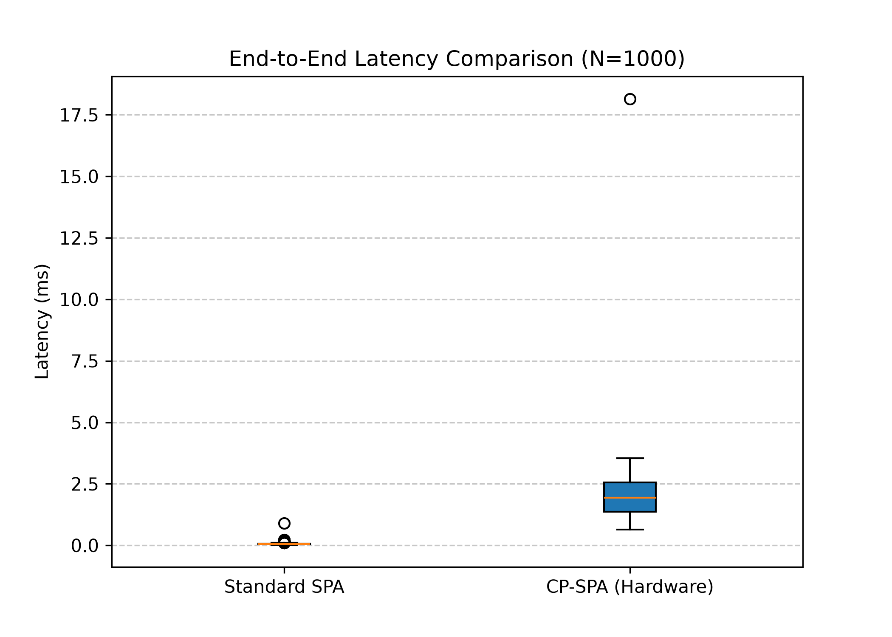
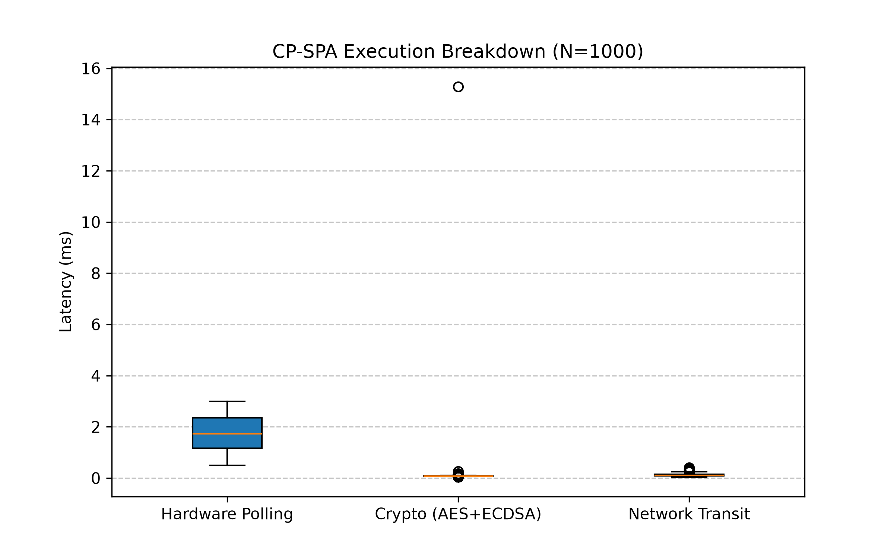
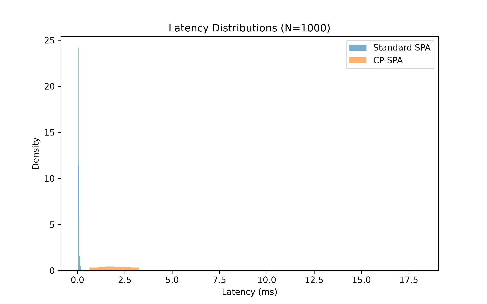

# A Cyber-Physical Approach to Single Packet Authorization in Zero-Touch Networks (CP-SPA)

## Abstract

Mission-critical networks require robust cybersecurity without the burden of heavy device patching[cite: 3]. While Single Packet Authorization (SPA) effectively conceals network ports, purely software-based SPA remains vulnerable to stolen digital keys[cite: 3]. Furthermore, automated Zero-Touch Networks (ZTNs) are highly susceptible to Adversarial Machine Learning (AML) manipulation[cite: 3].

This project introduces Cyber-Physical Single Packet Authorization (CP-SPA)[cite: 3]. It ports the FIDO2/WebAuthn User Presence Verification (UPV) primitive to the network firewall layer[cite: 1]. CP-SPA anchors cryptographic trust to live human presence rather than device identity[cite: 1]. A physical hardware gate (dual-sensor knock) must be activated to generate the AES-256-GCM payload[cite: 3]. This neutralizes remote replay attacks, bypasses AML evasion, and hard-blocks memory-scraping exploits[cite: 3].

## File Structure

- `spaConfig.py`: Shared cryptographic configuration establishing a 256-bit AES-GCM pre-shared key, strict 5-second anti-replay windows, and an 8-second self-healing firewall duration[cite: 3].
- `spaServer.py`: The Zero-Touch Network stealth router operating in a strict default-drop posture[cite: 3].
- `spaClient.py`: The edge controller built with a mathematically simulated hardware logic gate[cite: 3].
- `attackSim.py`: Standalone adversarial simulation empirically validating the hardware-gated defense against zero-day/memory-scraping intrusions[cite: 3].
- `latency_eval.py`: Phase 6 empirical latency benchmarking script that simulates 1000 trials to measure the overhead of hardware-gated authorization.

## Mathematical Security Guarantees

1. **Galois Field GF(2^128) Authentication:** SPA payload confidentiality and integrity are secured via AES-256-GCM[cite: 1]. The authentication tag is a polynomial evaluation over GF(2^128) using the reduction polynomial $f(x) = x^{128} + x^7 + x^2 + x + 1$[cite: 1].
2. **Replay Defense (Birthday Paradox):** The architecture utilizes a dynamically generated 96-bit nonce[cite: 1]. For $10^6$ authorization requests, the nonce collision probability is bounded by the Birthday Paradox at $6.33 \times 10^{-18}$, preventing Joux's Forbidden Attack[cite: 1].
3. **Attack Surface Decoupling:** In Standard SPA, breach probability relies strictly on key secrecy: $P(\text{Breach}) = P(K_{\text{compromised}})$[cite: 1]. In CP-SPA, network authorization is decoupled from the software state: $P(\text{Breach}) = P(K_{\text{compromised}}) \times P(S_{\text{phys}} = 1 \mid \text{Remote Exploit})$[cite: 1]. Because the physical sensors cannot be actuated remotely, $P(S_{\text{phys}} = 1 \mid \text{Remote Exploit}) = 0$, reducing the remote breach probability to absolute zero[cite: 1].

## Threat Model Matrix

| Threat Vector                      | Standard SPA (Software) | CP-SPA (Hardware-Gated) | Defense Boundary / Mitigation                         |
| :--------------------------------- | :---------------------- | :---------------------- | :---------------------------------------------------- |
| **Network Sniffing / Replay**      | Defended                | **Defended**            | AES-256-GCM + 96-bit Nonce[cite: 1]                   |
| **Remote Memory Scraping**         | Breached                | **Defended**            | Payload generation physically inhibited[cite: 3]      |
| **Adversarial ML Evasion**         | Breached                | **Defended**            | Deterministic physical logic overrides ML[cite: 3]    |
| **Direct Voltage Trace Tampering** | Vulnerable              | **Acknowledged**        | Requires physical tamper-evident enclosure[cite: 1]   |
| **UDP Inbound Flooding (DoS)**     | Susceptible             | **Acknowledged**        | Standard default-DROP rate-limiting required[cite: 4] |

## Progress Tracker

- **Phase 1 & 2 (August 2026): Network Foundation**
  - Placed and wired all network devices and IoT sensors in Cisco Packet Tracer[cite: 3].
  - Configured static IPv4 addressing across the local subnet and locked the router down with a strict `DENY ALL` ACL[cite: 3].
- **Phase 3 (August 2026): Hardware Simulation Pivot**
  - Finalized the Single Board Computer (SBC) logic gate, mapping physical interactions to logical outputs[cite: 3].
  - Pivoted from Packet Tracer to CPython due to Skulpt engine socket limitations[cite: 3].
- **Phase 4 (August 2026): CP-SPA Architecture**
  - Developed `spaConfig.py`, `spaServer.py`, and `spaClient.py`[cite: 3].
  - Enforced causal dependency by hard-blocking digital payload generation unless physical sensor authorization is simultaneously achieved[cite: 3].
- **Phase 5 (September 2026): Adversarial Simulation**
  - Developed `attackSim.py` to empirically validate the defense[cite: 3].
  - Proved Standard SPA is breached in ~300ms if the AES key is stolen[cite: 3]. Proved CP-SPA yields exactly 0 bytes of network egress under the identical threat model[cite: 3].
- **Phase 6 (October 2026): Empirical Benchmarking**
  - Developed `latency_eval.py` to simulate 1000 trials measuring the overhead of hardware-gated authorization[cite: 6].
  - Isolated $t_{\text{GPIO}}$, $t_{\text{crypto}}$, and $t_{\text{network}}$ metrics[cite: 4].
  - Generated statistical distribution graphs (Median, p95, p99) demonstrating the hardware check introduces statistically negligible overhead to the firewall ACL opening sequence[cite: 1, 4].

## Execution and Benchmarking

To run the automated empirical latency benchmarks locally:

```bash
# 1. Install required dependencies
python -m pip install cryptography numpy matplotlib

#2. Run the latency checks
python3 latency_eval.py
```

### Phase 6 Empirical Results




